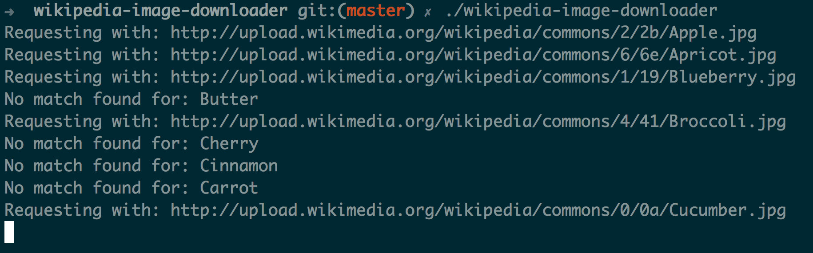
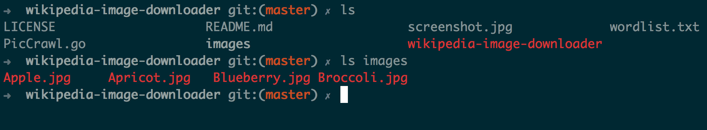

wikipedia-image-downloader
==========================

Give it a list of words and it'll download the images from wikipedia for you.




Instructions
============

```
go build
./wikipedia-image-downloader
```

Sample Word List
================
A sample wordlist.txt is available in the repository.

Follow me on twitter: [@hemantasapkota](https://twitter.com/laex_pearl) and don't forget to star this project.
